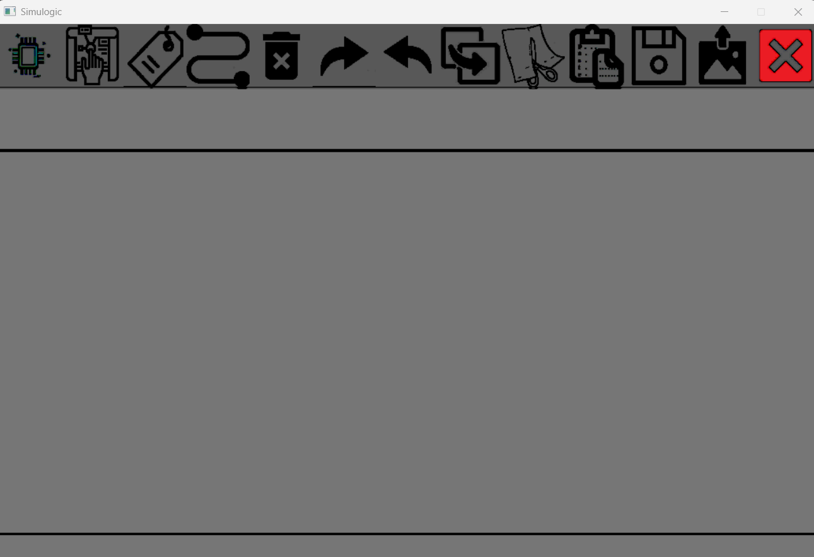
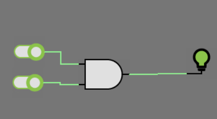
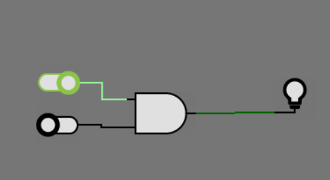
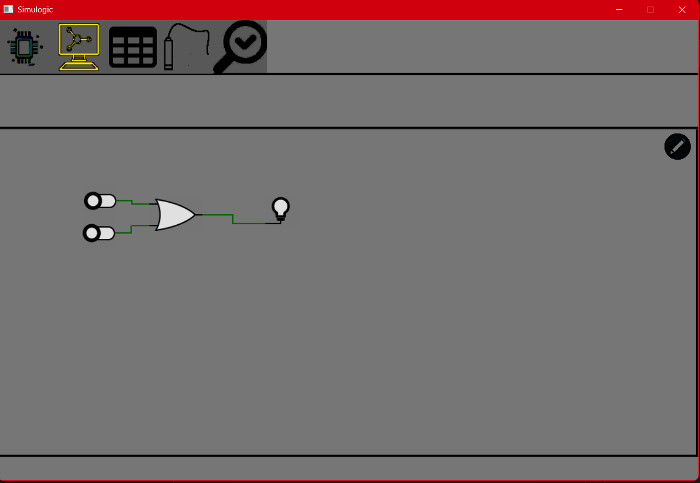
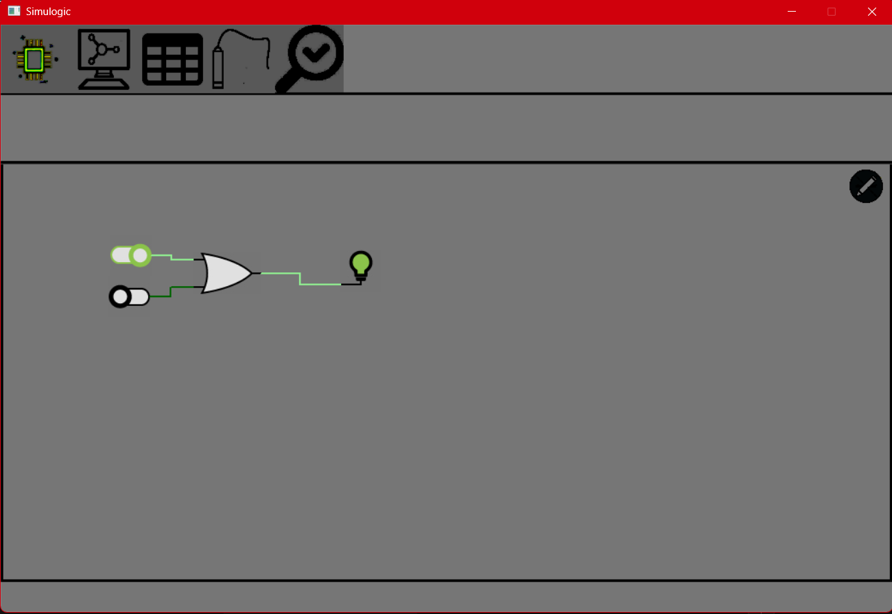
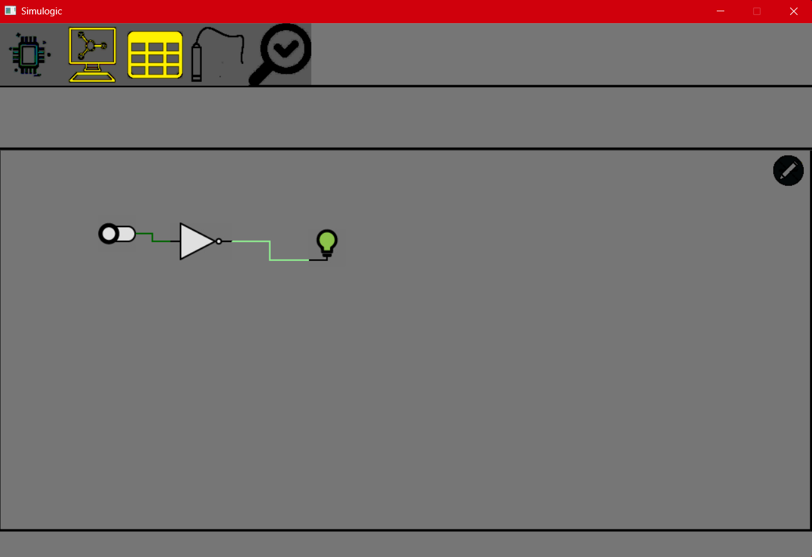
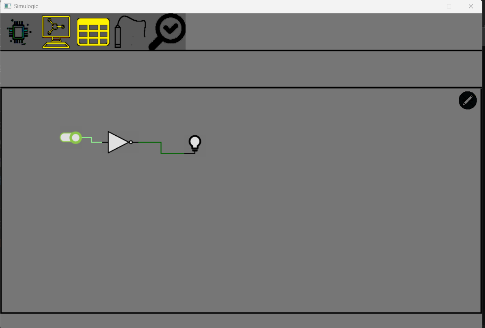
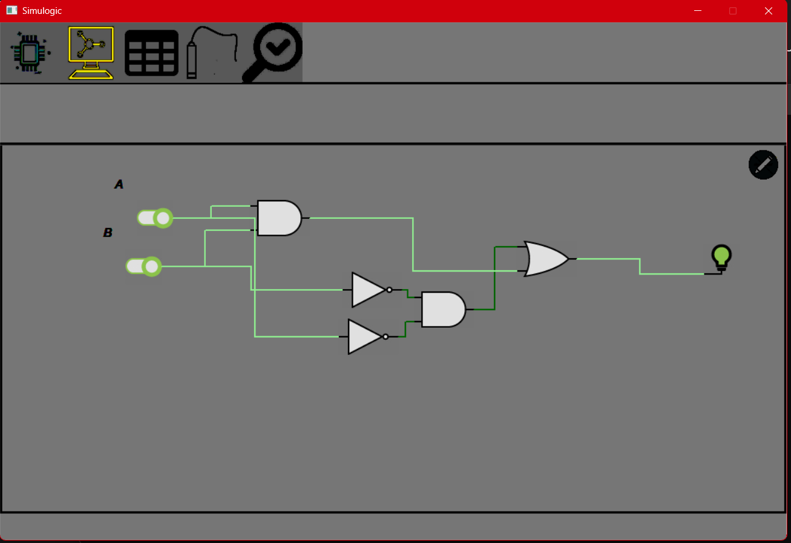
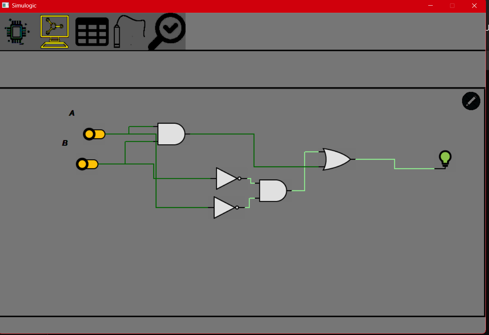

# Simulogic
 An integrated logic simulator that allows the design, edit, and simulation of simple logical circuits

## How to run
- Use Visual studio 2019 or higher. 
- Open the solution with it
- Build the project
- Run the project
- You should see this screen:
  - 

## Testing some logic
1. Simple And
   1. 
   2. 
2. Simple Or
   1. 
   2. 
3. Simple Not
   1. 
   2. 
4. Some complex logic ((A and B) or (Not A and Not B))
   1. 
   2. 
   3. 